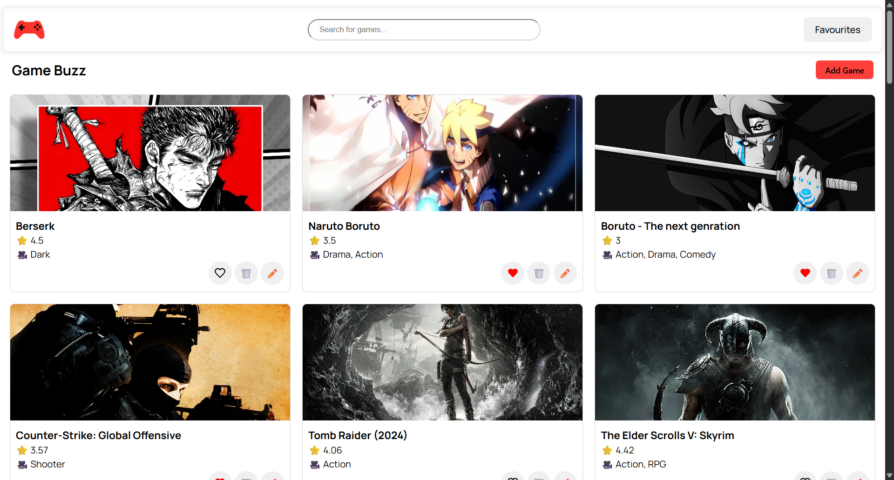

# Game Buzz

**Game Buzz** is a modern web application for browsing and managing game information. Built with **React**, **TypeScript**, **Redux Toolkit**, **Ant Design**, **TailwindCSS**, and **JSON Server**, the app provides a smooth and responsive UI for gaming enthusiasts.

---

## Table of Contents

* [Features](#features)
* [Tech Stack](#tech-stack)
* [Project Setup](#project-setup)
* [Available Scripts](#available-scripts)
* [API Setup](#api-setup)
* [Folder Structure](#folder-structure)
* [Screenshots / UI Preview](#screenshots--ui-preview)
* [Contributing](#contributing)
* [License](#license)

---

## Features

* Browse a list of games with details.
* Add, update, and delete game entries.
* Responsive and modern UI built with **Ant Design** and **TailwindCSS**.
* State management with **Redux Toolkit**.
* JSON Server used as a mock backend for development.

---

## Tech Stack

* **Frontend:** React, TypeScript
* **State Management:** Redux Toolkit
* **UI Library:** Ant Design, TailwindCSS
* **Backend (Mock):** JSON Server
* **HTTP Requests:** Axios
* **Build Tool:** Vite

---

## Project Setup

Follow these steps to get the project running locally:

### 1. Clone the Repository

```bash
git clone <your-repo-url>
cd game-buzz
```

### 2. Install Dependencies

Make sure you have **Node.js v18+** installed. Then run:

```bash
npm install
```

### 3. Start JSON Server

The app uses **JSON Server** for mock API endpoints. Start it by running:

```bash
npx json-server --watch db.json --port 5000
```

> `db.json` contains the mock data for games. You can modify or add more games here.

### 4. Start the Development Server

```bash
npm run dev
```

This will start the app on `http://localhost:5173` (default Vite port).

### 5. Build for Production

```bash
npm run build
```

---

## Available Scripts

* `npm run dev` – Start the development server.
* `npm run build` – Build the app for production.
* `npm run preview` – Preview the production build locally.
* `npm run lint` – Run ESLint to check for code issues.

---

## API Setup

The project uses **JSON Server** to mock RESTful APIs.
The default **db.json** file structure is:

```json
{
  "games": [
    {
      "id": 1,
      "title": "Game Name",
      "description": "Game description here",
      "rating": 8,
      "genre": "Action",
      "slug": "game-name"
    }
  ]
}
```

## Folder Structure

```
game-buzz/
│
├── public/                  # Public assets
├── src/
│   ├── api/                 # Axios requests or API logic
│   ├── components/          # Reusable components
│   ├── pages/               # Page components
│   ├── redux/               # Redux slices and store
│   ├── styles/              # Tailwind / CSS files
│   └── main.tsx             # App entry point
├── db.json                  # Mock database for JSON Server
├── package.json
├── tailwind.config.js
└── vite.config.ts
```

---

## Screenshots / UI Preview


